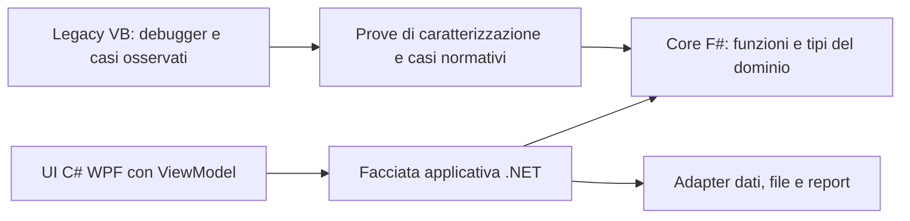

> Aggiornamento 7 ottobre 2026: la soluzione completa di 26 progetti VB compila.
> Per stato attuale, avvio Lancion e funzionalita' ancora sospese, vedere
> [il checkpoint di ripristino](full-application-restoration.md). I risultati precedenti sotto sono storici.

# Legacy come riferimento, nuovo core F#

L'obiettivo aggiornato è capire il software ingegneristico attraverso breakpoint,
input riproducibili e osservazione delle formule, poi costruire da zero un core
F# separato dalla UI C#/WPF/MVVM. Il porting VB serve come riferimento eseguibile:
non sarà l'architettura del nuovo prodotto. Il divieto di riscrittura del legacy
in C# resta applicato alla copia di riferimento; C# è previsto per la nuova UI.

## Primo modulo: dimensionamento ASME / recipienti in pressione

Il modulo scelto dall'utente è ASME. Selezionare **ASME cylinder thickness and
pressure (original VB)** in VS Code e premere F5. Servono .NET 10 SDK, Python 3
e il debugger .NET Microsoft (estensione C#). Il banco di prova dei cilindri è
headless e gira anche su Linux; non richiede Office, AutoCAD, MDB o WinForms.
Il primo arresto è all'ingresso. Mettere un breakpoint sulle chiamate CylThk e
CylPres in tools/AsmeCalculation.Debug/Program.vb e premere Step Into/F11.

Il PDB mappa i corpi eseguiti al file originale legacy/AsmeVip.NET/Calcoli.vb:
CylThk (riga 683), CylPres (319), ASME1 (339) ed Euro (330). La generazione sotto
obj copia quei quattro metodi senza modificarli e registra checksum SHA256 e
posizioni originali; non si committano sorgenti generati. Sono definite soltanto
le variabili globali richieste, inizializzate esplicitamente dal caso di prova.
Erro(20) e MessageBox sono adapter di osservazione: registrano il codice/messaggio
invece di aprire finestre. Non simulano un materiale o una formula mancante.
Non è l'esecuzione dell'intero Calcoli/CalcASME né della selezione dei materiali.

Seguire P0, R, s, E, SWR, T0, KZ e la selezione USStr nel debugger.
L'esempio usa unità coerenti MPa/mm e input dimostrativi, non un recipiente reale:
P=2, R=500, S=138, E=0,85, SWR=0. L'esecuzione nel cloud restituisce
**t=8,613264 mm** e pressione inversa **2 MPa**, ramo UG-27(c).

```sh
dotnet run --project tools/AsmeCalculation.Debug -c Debug
# Cinque argomenti: pressione, raggio, tensione ammissibile, efficienza, SWR
dotnet run --project tools/AsmeCalculation.Debug -c Debug -- 60 500 138 0.85 0
dotnet run --project tools/AsmeCalculation.Debug -c Debug -- --check
```

Passano **21 controlli di caratterizzazione**: rami sottili/spessi, convenzioni
raggio interno/esterno, calcolo inverso, default E=0, errore 20 e modifica P0.
Il confronto doppia precisione è indipendente nei casi semplici; non certifica
l'edizione applicabile della norma né i limiti di impiego. I valori di stress
sono forniti, non letti dalle tabelle materiali. Non sono modellate corrosione,
tolleranze, temperatura/materiali, carichi esterni, aperture e fondi.

Due comportamenti storici sono conservati e da investigare prima del port F#:

- ASME1 usa il campo globale SWR, mentre CylPres riceve un parametro omonimo
  che non aggiorna quel campo. Nel banco entrambi sono inizializzati in modo
  esplicito; un controllo espone la dipendenza dallo stato globale.
- Nel ramo iMAWP>0 con s*E-P0<=0, CylThk assegna P0=0.9*2*E. Non è stato
  sostituito con un risultato che sembri più ragionevole. Annotare origine,
  significato fisico e unità prima di decidere il comportamento del nuovo core.

La configurazione **Legacy interpolation step by step (VB, Windows)** è un
secondo percorso, con riferimento diretto a RoutBase1 compilato: entra in
src/RoutBase/clsTrigon.vb, InterLogar, usato dalle carte materiali. Richiede il
runtime Windows Desktop e non è stato eseguito qui. Il banco ASME principale
invece è stato eseguito; la sessione interattiva VS Code resta da verificare sul
computer dell'utente. La GUI applicativa completa resta bloccata in altri progetti.

## Passaggio al core nuovo

Per ogni percorso scelto, registrare input con unità, dati dei materiali,
edizione della norma, rami eseguiti, risultati intermedi e arrotondamenti.
Le prove di caratterizzazione descrivono il comportamento legacy, non ne
certificano la correttezza ingegneristica: confrontare anche esempi normativi
indipendenti. Conservare gli scostamenti e gli eventuali difetti del vecchio codice.

Il core F# userà record immutabili, unità esplicite, tipi distinti per i casi
fisici, funzioni pure e Result per input non validi o calcoli non applicabili.
Nessuna dipendenza da WinForms, WPF, COM, Office o database nel dominio.
La facciata .NET esporrà contratti semplici alla UI C#; i ViewModel gestiranno
comandi e stato di presentazione. File, database e report resteranno adapter.
I calcoli restituiranno anche passaggi e riferimenti della formula, utili a
spiegazione, confronto e verifica. La precisione Single del legacy va registrata:
passare a double richiede confronti e tolleranze per grandezza, non una
sostituzione automatica di tutti i tipi numerici.



Il primo modulo scelto è il dimensionamento ASME dei recipienti in pressione. Non sono state inventate formule ASME, tabelle materiali o nuove
implementazioni F# prima di acquisire i casi di riferimento.
