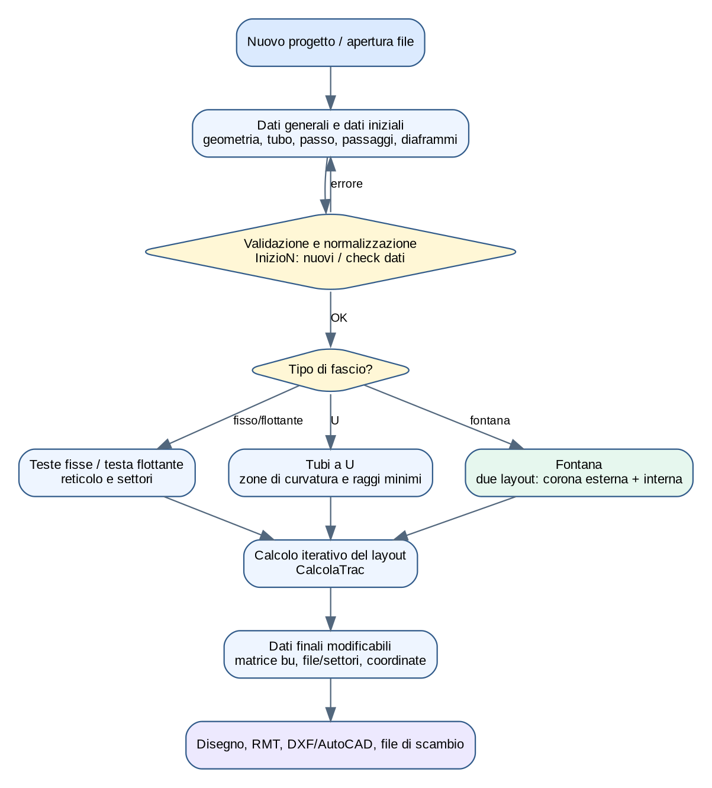
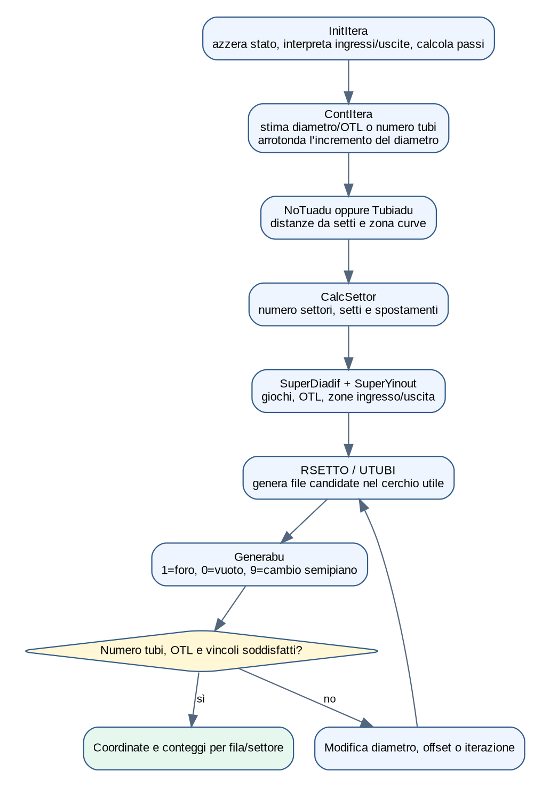
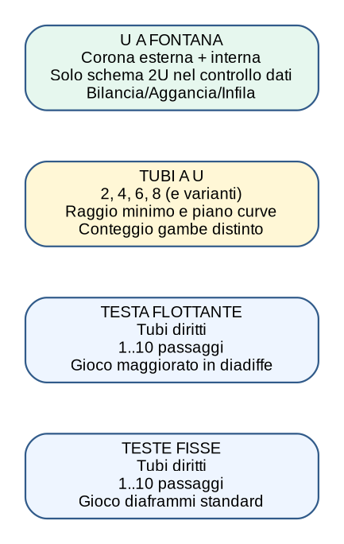
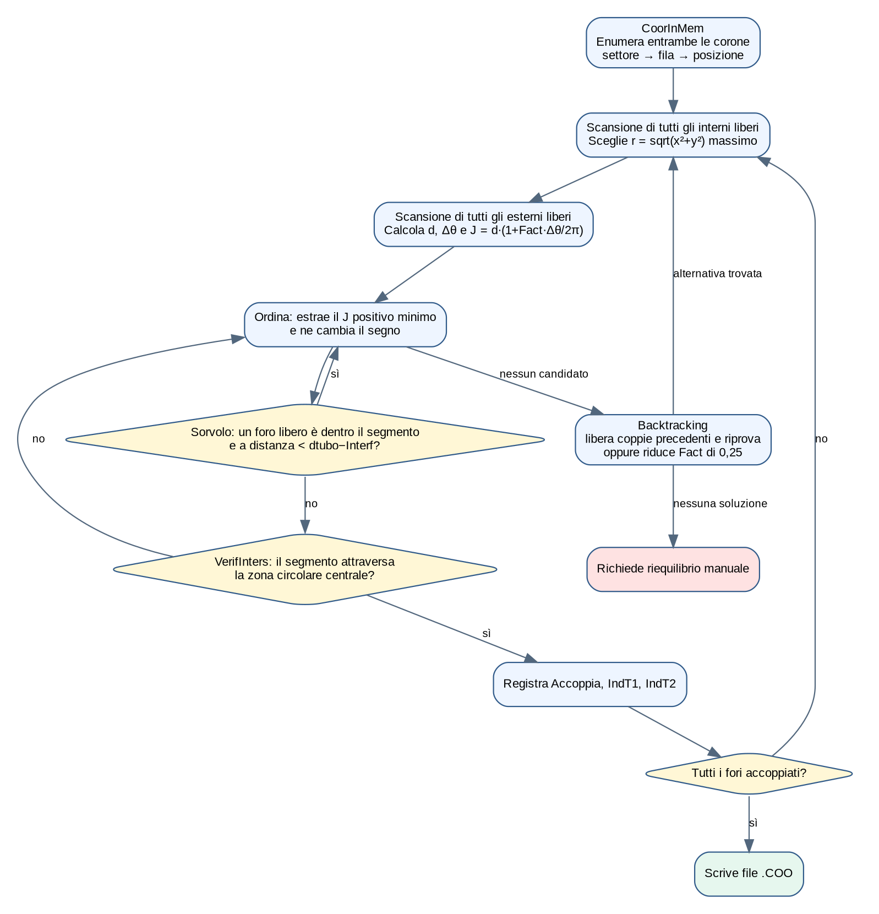
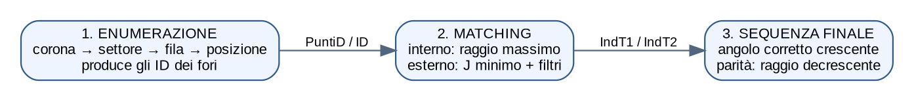
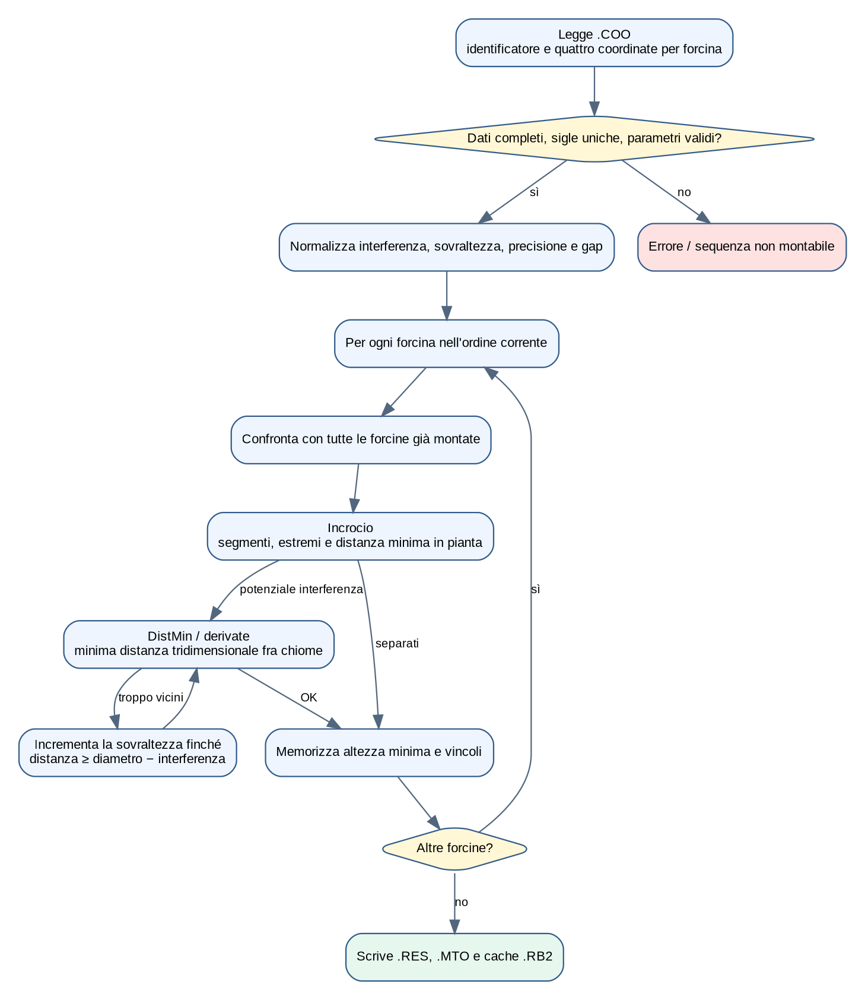

> **Scopo e limiti.** Questo documento descrive ciò che implementa il codice
> VB.NET presente in `src/Traccia`. Non sostituisce una verifica di progetto,
> una norma TEMA/ASME o la validazione dei risultati da parte di un ingegnere.
> I nomi delle grandezze sono mantenuti vicini al legacy per facilitare
> breakpoint, confronto e futura estrazione del core matematico.

## Indice

1. Scopo e architettura del modulo
2. Dati in ingresso, stato e risultati
3. Algoritmo comune di generazione del layout
4. Tipologie: teste fisse, testa flottante, U e fontana
5. Fontana: generazione e bilanciamento
6. Fontana: aggancio
7. Fontana: infilaggio
8. Sequenza e output
9. Percorso consigliato nel debugger
10. Mappa del codice e rischi della futura riscrittura

# 1. Che cosa fa il modulo

Traccia genera la disposizione dei fori sulle piastre tubiere di scambiatori
Shell & Tubes. A partire da diametri, tubo, passo, schema del reticolo, numero
di passaggi e vincoli geometrici, costruisce file e settori, determina quali
posizioni contengono un tubo, calcola OTL e conteggi e produce disegni e file
di scambio. Per i fasci a U a fontana aggiunge tre problemi distinti:

1. equilibrare il numero di fori tra corona interna ed esterna;
2. accoppiare ogni foro interno con un foro esterno senza bloccare il montaggio;
3. simulare l'infilaggio tridimensionale e ricavare sovraltezze e sequenza.



Le strutture principali sono contenute in `clsTracciatura.typDaTos`. La matrice
`bu(fila,posizione)` codifica il layout: `1` indica un foro/tubo presente, `0`
una posizione vuota e `9` una discontinuità usata per passare al semipiano
simmetrico. Gli array `x`, `y`, `NumeroTubiFila`, `FilaIniziale`,
`FilaFinale`, `NumeroTubiSettore`, `ici` e `hsym` descrivono la geometria
compatta che viene poi trasformata in coordinate.

# 2. Dati in ingresso, stato e risultati

## 2.1 Ingressi geometrici essenziali

| Gruppo | Variabili legacy indicative | Significato |
|---|---|---|
| Contorno | `di0`, `di1`, `OTL`, `otimp` | diametro imposto/calcolato e outer tube limit |
| Tubo | `dtubo`, `Spmm`, `Tublu` | diametro, spessore e lunghezza tubo |
| Reticolo | `TipoPasso`, `Passo`, `PassoVerticale`, `PassoOrizzontale` | orientamento e passo del reticolo |
| Circuitazione | `PassoFascio`, `NumeroSettori` | numero/configurazione dei passaggi e settori |
| U-bend | `radiu`, `CurveInPianoVert`, `Passi4CurveVert` | raggio minimo e orientamento curve |
| Diaframmi | `pdiaf`, `p1`, `tagli`, `tcava` | passo, taglio e cava del setto |
| Fontana | `cori`, `coriint`, `coriext`, `passoint`, `Interf`, `GapCurve`, `Varco` | separazione delle corone e vincoli di montaggio |

La routine di controllo verifica intervalli ed enumerazioni, coerenza del
numero di passaggi, presenza di tubo/passo/diametri e vincoli specifici. Per
la fontana il controllo ammette il percorso `_2U`; per gli U tradizionali
sono trattate le configurazioni pari previste dal codice.

## 2.2 Risultati

- coordinate dei centri dei fori e appartenenza a fila/settore;
- numero totale di tubi/fori e numero per fila e settore;
- OTL, diametro limite, area e perimetro della tracciatura;
- geometria di setti, tagli, tiranti, sealing strips e zone libere;
- per la fontana: coppie interno/esterno, sovraltezze, raggi, ordine di montaggio;
- disegno su schermo, DXF/AutoCAD, RMT e file intermedi/finali.

# 3. Algoritmo comune di generazione del layout

La routine centrale è `CalcolaTrac`. Non colloca semplicemente punti in un
cerchio: esegue un ciclo iterativo perché numero tubi, OTL, diametro e
disposizione delle file si influenzano reciprocamente.



Passo per passo:

1. **`InitItera`** azzera lo stato transitorio, interpreta le opzioni di zona
   ingresso/uscita, stabilisce margini delle cave e calcola le componenti del
   passo con `RPASSO`.
2. **`ContItera`** stima un diametro iniziale dall'area del reticolo quando il
   diametro non è imposto; se manca il numero di tubi ne ricava una stima
   dall'area utile. Il diametro viene arrotondato a incrementi dipendenti dalla
   dimensione.
3. **`NoTuadu` / `Tubiadu`** definiscono le distanze dai setti; nel caso U
   trattano la zona di curvatura e il raggio.
4. **`CalcSettor`** traduce il codice dei passaggi in settori e setti e assegna
   gli scostamenti orizzontali. Il comportamento cambia per codici pari,
   dispari e per curve nel piano verticale.
5. **`SuperDiadif`** calcola il gioco fra fascio e diaframmi; **`SuperYinout`**
   uniforma o calcola le zone di ingresso/uscita.
6. **`RSETTO` / `UTUBI`** generano le file candidate all'interno del contorno,
   applicando simmetrie, setti e limiti della curva U.
7. **`Generabu`** materializza la matrice di presenza. Rimuove le posizioni che
   cadono nella corona esclusa, aggiorna conteggi e calcola l'OTL massimo.
8. Il ciclo confronta tubi ottenuti, OTL e diametri richiesti; modifica offset
   o diametro e ripete fino a soluzione o al limite di iterazioni.

# 4. Tipologie di fascio



## 4.1 Teste fisse (`TesteFisse = 1`)

Il tubo è diritto e collega due piastre solidali all'apparecchio. Il layout è
generato una sola volta. Il numero di passaggi determina settori e setti; il
reticolo può essere triangolare o quadrato, normale o ruotato. Il gioco
diaframmi è calcolato da `diadiffe` con la serie destinata ai fasci non
flottanti. Non esistono accoppiamento fra due corone né simulazione delle
chiome U.

Controlli principali: tubo dentro OTL, distanza da contorno/cave, simmetria,
zone d'ingresso e uscita, coerenza del numero di tubi e dei passaggi, tagli dei
diaframmi e posizioni escluse.

## 4.2 Testa flottante (`TestaFlottante = 2`)

Il generatore geometrico è quello dei tubi diritti, ma `diadiffe` usa giochi
maggiorati e soglie dipendenti dal diametro (`di1`). Questo influenza l'OTL
disponibile prima della generazione delle file. Il resto della pipeline —
settori, matrice `bu`, coordinate, disegno e output — resta comune.

## 4.3 Tubi a U (`Utube = 3`)

Ogni tubo ha due gambe collegate da una curva. Il programma distingue il
numero di fori/gambe dal numero di tubi e riserva una zona alla curvatura.
`Tubiadu` usa il raggio richiesto (`radiu`) o lo riconcilia con la distanza
geometrica disponibile; le opzioni `CurveInPianoVert` e `Passi4CurveVert`
modificano simmetrie, settori e conteggi. Il codice gestisce configurazioni a
2, 4, 6, 8 e ulteriori codici pari presenti nell'enumerazione legacy.

Controlli specifici: raggio minimo, spazio per la curva, distanza sui setti,
duplicazione corretta delle gambe, posizione della fila centrale e coerenza
fra configurazione U e numero di passaggi.

## 4.4 Tubi a U a fontana (`Fontana = 4`)

La fontana è modellata con **due istanze di `typDaTos`**: dataset `0` per la
corona esterna e dataset `1` per quella interna. Non è quindi un semplice
caso grafico del fascio U: richiede due tracciature compatibili e un problema
di accoppiamento/montaggio.


# 5. Fontana: generazione e bilanciamento

## 5.1 Generazione delle due zone

`GenCorInt` copia nel dataset interno i dati comuni, re-inizializza gli array e
imposta passo e diametro della corona interna. `Fontana` salva la condizione
iniziale e tratta temporaneamente entrambe le zone come layout a teste fisse a
un passaggio, così da riutilizzare `CalcolaTrac` senza duplicarne la matematica.

- Se il numero tubi non è imposto, **`Calc1`** calcola prima la corona esterna,
  poi l'interna e propaga il diametro ottenuto.
- Se il numero tubi è imposto, **`Calc2`** calcola prima l'interna, ricava il
  gap tra zone e calcola infine l'esterna.

Al termine ripristina il tipo Fontana e `_2U`. Questa mutazione temporanea è
importante per il debug: un breakpoint dentro `CalcolaTrac` vedrà
`TipoFascio=TesteFisse`, anche se l'operazione complessiva è una fontana.

## 5.2 Bilanciamento

Le due zone possono produrre numeri diversi di fori e, di norma, non meno del
numero richiesto. `inizio2` decide lo stato successivo:

- conteggi uguali: passa all'aggancio;
- una zona ha meno fori del richiesto: soluzione impossibile;
- esistono fori eccedenti: richiede bilanciamento.

`Bilancio` non crea ancora le coppie. Prima `DistInMem` enumera le posizioni,
calcola il raggio e le riordina prevalentemente per raggio decrescente; un
secondo passaggio cerca di mantenere vicini settori adiacenti nei gruppi con
raggio quasi uguale (`|Δr| < 0,1`). Poi elimina dall'inizio dell'elenco tante
posizioni quante sono eccedenti, marcando la cella originale `bu = "0"` e
aggiornando i conteggi di fila, settore e corona.

```text
DistInMem()       // coordinate + raggio; ordine prevalentemente decrescente

PER zona = ESTERNA, INTERNA
    totale = ktotal(zona)
    SE ntubi(zona) > 0
        obiettivo = ntubi(zona)
    ALTRIMENTI SE zona = ESTERNA
        obiettivo = ktotal(INTERNA)
    ALTRIMENTI
        obiettivo = ktotal(INTERNA)
    FINE SE

    PER i = 1 .. totale-obiettivo
        (fila,posizione,settore) = riferimenti del foro ordinato i
        bu[fila,posizione] = "0"
        NumeroTubiFila[fila]--
        NumeroTubiSettore[settore]--
        ktotal(zona)--
    FINE PER
FINE PER
```

Di conseguenza il bilanciamento modifica il set di fori ammessi **prima** che
`CoorInMem` assegni gli identificativi usati da `Aggancia`. Non effettua un
matching fra corone e non garantisce da solo che il matching esista; la
documentazione legacy prevede infatti correzioni manuali nei casi intrappolati.

# 6. Fontana: algoritmo di aggancio, in dettaglio

L'aggancio costruisce una corrispondenza biunivoca fra i fori della corona
interna (`zona = 1`) e quelli della corona esterna (`zona = 0`). Non usa una
ricerca globale dell'abbinamento ottimo: è un algoritmo **greedy con filtri e
backtracking locale**. Questa distinzione è importante quando si confronta il
risultato del programma con un algoritmo moderno di matching.



## 6.1 Le tre nozioni di “ordine” non vanno confuse

Il software usa tre ordinamenti differenti, in momenti differenti:

| Momento | Criterio effettivo | Scopo |
|---|---|---|
| Enumerazione (`CoorInMem`) | zona, settore crescente, fila crescente, posizione crescente | assegnare un indice stabile a ogni foro |
| Costruzione delle coppie (`Aggancia`) | interno libero a raggio massimo; esterni provati per costo crescente `J` | decidere chi viene collegato con chi |
| Sequenza finale (`Riordino`) | angolo corretto con `Anomal0`; quasi-parità angolare: raggio interno decrescente | stabilire l'ordine di montaggio/controllo |



Quindi la risposta breve è: **il raggio decide quale foro interno trattare per
primo; distanza e deviazione angolare classificano gli esterni; l'angolo
polare ordina le coppie soltanto dopo che gli abbinamenti sono già stati
decisi.**

## 6.2 Come vengono numerati e memorizzati i fori

`CoorInMem` percorre separatamente le due corone. Per ciascuna corona visita i
settori, le file del settore e le posizioni della fila. `CoorXY` traduce la
matrice compatta `bu` in coordinate cartesiane; soltanto `iCod = 0`, cioè una
cella `bu = "1"`, diventa un foro disponibile.

```text
PER zona = 0, 1
    idForo = 0
    PER settore = 1 .. NumeroSettori(zona)
        PER fila = FilaIniziale(settore) .. FilaFinale(settore)
            SE fila > 0
                PER posizione = 1 .. ici(fila)
                    (x, y, codice) = CoorXY(zona, fila, posizione)
                    SE codice = 0
                        idForo = idForo + 1
                        PuntiD[idForo,zona]    = (x,y)
                        DistCentro[...]       = sqrt(x²+y²)
                        Anomal[...]           = atan2 normalizzato da arco(...)
                        Fila[...]             = fila
                        Posizbu[...]          = posizione
                        Settore[...]          = settore
                    FINE SE
                FINE PER
            FINE SE
        FINE PER
    FINE PER
FINE PER
```

L'indice non rappresenta né il raggio né la vicinanza fra le due corone. A
parità dei criteri numerici usati più avanti, prevale però il primo elemento
incontrato in questo ordine, perché i confronti del legacy usano `<` o `>` e
non sostituiscono un valore uguale.

## 6.3 Stato dell'accoppiamento

| Struttura | Significato |
|---|---|
| `PuntiD(id,zona)` | coordinate cartesiane del centro del foro |
| `Accoppia(id,zona)` | `0` se libero, altrimenti numero della coppia assegnata |
| `IndT1(coppia)` | indice del foro interno della coppia |
| `IndT2(coppia)` | indice del foro esterno della coppia |
| `NewInd(k)` | indice reale del k-esimo candidato esterno |
| `NewDist(k)` | costo del candidato; il segno negativo significa “già provato” |
| `Fila`, `Posizbu`, `Settore` | provenienza del foro nella matrice geometrica |

All'avvio gli array di assegnazione vengono azzerati. `Aggancia` imposta
esplicitamente `Fact = 2`; pertanto in questa routine il valore iniziale non è
quello eventualmente letto in precedenza dall'INI. Se l'intero tentativo deve
essere rigenerato, `Fact` viene diminuito di `0,25`, fino al limite descritto
nel paragrafo 6.9.

## 6.4 Scelta del foro della corona interna

Per ogni nuova coppia il programma spazzola **tutti** i fori interni e sceglie
quello libero con distanza massima dall'origine:

```text
raggioMigliore = -1
interno = nessuno

PER i = 1 .. numeroForiInterni
    SE Accoppia[i,INTERNA] = 0
        r = sqrt(PuntiD[i,INTERNA].x² + PuntiD[i,INTERNA].y²)
        SE r > raggioMigliore
            raggioMigliore = r
            interno = i
        FINE SE
    FINE SE
FINE PER

SE interno esiste
    Accoppia[interno,INTERNA] = numeroCoppia
    IndT1[numeroCoppia] = interno
ALTRIMENTI
    accoppiamento terminato
FINE SE
```

È dunque una selezione ripetuta “dall'esterno verso il centro”. Non viene
eseguito prima un sort completo: a ogni coppia il massimo viene cercato con
una nuova scansione lineare. Due interni allo stesso raggio sono trattati
nell'ordine di enumerazione di `CoorInMem`.

## 6.5 Generazione di tutti i candidati esterni

Fissato l'interno `I`, il codice spazzola l'intero set esterno. Un foro `E` è
candidato se non è ancora assegnato. Esiste inoltre il controllo legacy
`indiceEsterno <> indiceInterno`: confronta identificativi appartenenti a due
array distinti e non una posizione geometrica; va preservato nei test di
regressione, ma non va interpretato come filtro di distanza.

Per ogni candidato calcola:

```text
d       = sqrt((E.x-I.x)² + (E.y-I.y)²)
rI      = sqrt(I.x² + I.y²)
angRad  = 0                         se rI è circa zero
          arco(I.x/rI, I.y/rI)      altrimenti
angIE   = arco((E.x-I.x)/d, (E.y-I.y)/d)
delta   = abs(angIE-angRad)
SE delta > PI: delta = 2*PI-delta

J(E|I) = d * (1 + Fact * delta/(2*PI))
```

`delta` è quindi la deviazione minima, compresa fra `0` e `π`, fra la
direzione radiale uscente dall'origine attraverso `I` e il segmento `I→E`.
Con `Fact = 2`, la penalità moltiplicativa varia da `1` (direzione radiale) a
`2` (direzione opposta). L'algoritmo favorisce collegamenti corti e radiali,
ma una maggiore radialità può compensare una distanza geometrica maggiore.

## 6.6 “Ordina” non ordina l'array: estrae il minimo successivo

La funzione legacy `Ordina` esegue una scansione di `NewDist` e restituisce la
posizione del più piccolo valore strettamente positivo. Subito dopo ne cambia
il segno. Le chiamate successive ignorano quindi i candidati già provati.

```text
FUNZIONE ProssimoCandidato(mode)
    SE mode = RESET
        PER ogni k: SE NewDist[k] < 0: NewDist[k] = -NewDist[k]
    FINE SE

    minimo = +infinito
    posizione = 0
    PER k = 1 .. numeroCandidati
        SE NewDist[k] > 0 E NewDist[k] < minimo
            minimo = NewDist[k]
            posizione = k
        FINE SE
    FINE PER
    NewDist[posizione] = -NewDist[posizione]
    RITORNA posizione
FINE FUNZIONE
```

È una enumerazione lazy per costo crescente, equivalente a ripetere una
selezione del minimo. A parità esatta di costo vince il primo candidato
inserito, quindi il primo nell'ordine esterno di `CoorInMem`.

## 6.7 Primo filtro: `Sorvolo`

Per la coppia provvisoria `I→E`, `Sorvolo` considera **entrambi i dataset** e
scandisce tutti i fori ancora liberi, esclusi i due estremi attuali. Per ogni
foro libero `P` calcola la proiezione lungo il segmento e la distanza
perpendicolare dalla sua retta.

```text
L = lunghezza(I,E)
PER zona = ESTERNA, INTERNA
    PER ogni foro libero P della zona, P diverso dall'estremo corrente
        s = proiezione di (P-I) sulla direzione unitaria I→E
        SE 0 < s < L                       // P cade fra i due estremi
            h = distanza(P, retta I→E)
            soglia = dtubo(zona) - Interf(zona)
            SE h < soglia
                RIFIUTA: la coppia sorvola P
            FINE SE
        FINE SE
    FINE PER
FINE PER
ACCETTA IL FILTRO
```

Il confronto nel sorgente è
`h < (dtubo/2)*2 - Interf`, quindi esattamente `dtubo - Interf`. I fori già
assegnati non sono controllati qui; lo scopo specifico è non chiudere o
ostruire, in proiezione, un foro che deve ancora essere utilizzato. Se il
candidato fallisce, viene richiesto a `Ordina` il successivo costo positivo e
l'intera scansione ricomincia.

## 6.8 Secondo filtro: `VerifInters`

Questo nome può trarre in inganno: nella versione corrente non confronta il
segmento con tutte le coppie precedenti. Controlla se `I→E` attraversa la zona
circolare centrale, modellata dalla circonferenza di raggio `cinter` con una
fascia legata a `dtubo/2`.

```text
SE cinter < dtubo/2
    RITORNA valido
FINE SE

intersezioni = intersezioni(retta E→I,
                            cerchio centrato in (0,0),
                            raggio cinter,
                            fascia dtubo/2)
valido = vero

PER ciascuna intersezione Q restituita
    a = dot(Q-E, direzione E→I)
    b = dot(Q-I, direzione E→I)
    SE a*b < 0       // Q è internamente al segmento E-I
        valido = falso
    FINE SE
FINE PER
RITORNA valido
```

La coppia è ammessa solo se `Sorvolo = 0` **e** `VerifInters = vero`.

## 6.9 Cosa succede quando nessun candidato è valido

Esistono due livelli di recupero:

1. **alternativa per lo stesso interno:** finché esistono costi positivi,
   prova il candidato successivo. Esauriti i candidati, `Ordina(mode=1)`
   ripristina i segni e restituisce nuovamente il minimo, che viene fatto
   transitare nel ramo di fallimento;
2. **backtracking sulle coppie:** il programma arretra nelle coppie già
   create, cerca una posizione precedente compatibile con l'interno rimasto
   intrappolato, cancella graficamente e logicamente le assegnazioni dalla
   profondità scelta in avanti, colloca l'interno nella coppia arretrata e
   riprende la costruzione.

Pseudocodice strutturale del recupero:

```text
SE candidato fallisce definitivamente
    evidenzia interno intrappolato
    SE utente annulla: termina senza soluzione

    coppiaOriginale = coppiaCorrente
    SE profonditaBacktracking > 0
        coppiaCorrente = profonditaBacktracking

    RIPETI
        coppiaCorrente--
        SE coppiaCorrente = 1: termina senza soluzione

        esternoPrecedente = IndT2[coppiaCorrente]
        SE VerifInters(esternoPrecedente, internoIntrappolato)
           E la profondità consente di arretrare
            PER c = coppiaCorrente .. coppiaOriginale-1
                libera l'interno di c
                per c successive libera anche l'esterno di c
                cancella il collegamento disegnato
            FINE PER
            libera l'interno della coppia originale
            assegna internoIntrappolato alla coppia arretrata
            SE Sorvolo(internoIntrappolato, esternoPrecedente) = 0
                profonditaBacktracking = coppiaCorrente
                riprendi dalla coppia successiva
            FINE SE
        FINE SE
    FINCHÉ non trova un punto di ripresa
FINE SE
```

Se invece una scansione globale resta incompleta, il codice diminuisce
`Fact` di `0,25`, rigenera la tracciatura esterna (`SubTraccia(0)` e
`datiout(0)`) e ricomincia da zero. Partendo da `2`, sono possibili i valori
`1,75, 1,50, …, -0,25`; quando la riduzione porta `Fact <= -0,5`, termina con
“Non è stato possibile trovare una soluzione”. Un `Fact` progressivamente
più piccolo riduce il peso della direzione angolare rispetto alla distanza.

## 6.10 Registrazione della coppia e scansione completa

Superati i filtri:

```text
Accoppia[esterno,ESTERNA] = numeroCoppia
IndT2[numeroCoppia] = esterno
disegna segmento interno→esterno
passa alla coppia successiva
```

Il ciclo termina quando non esiste più un interno libero. Il file `.COO`
registra per ogni coppia: numero, coordinate interne ed esterne, fila e
posizione `bu` dei due estremi e identificativi `IndT1`/`IndT2`. Se un `.COO`
preesistente viene accettato dall'utente, il programma recupera direttamente
gli identificativi e non riesegue il matching.

## 6.11 Esempio numerico della graduatoria

Si consideri l'interno `I=(30,40) mm`: il suo raggio è `50 mm` e la direzione
radiale vale `53,13°`. Tre esterni liberi, tutti a distanza `50 mm`, danno con
`Fact=2`:

| Candidato | Direzione `I→E` | `Δθ` | Costo `J` |
|---|---:|---:|---:|
| A `(60,80)` | `53,13°` | `0°` | `50,00` |
| C `(30,90)` | `90°` | `36,87°` | `60,24` |
| B `(80,40)` | `0°` | `53,13°` | `64,76` |

L'ordine di prova è A, C, B. Se A sorvola un foro libero, A viene marcato come
provato e si passa a C; non si modifica l'interno corrente. Se anche tutti gli
altri falliscono, scatta il recupero descritto sopra.

## 6.12 Complessità e limiti osservabili

Con `N` fori per corona, la scelta ripetuta degli interni è `O(N²)`. Per ogni
interno si generano fino a `N` candidati; ogni estrazione del minimo è lineare
e ogni `Sorvolo` scandisce fino a `2N` fori. Nel caso sfavorevole il solo
matching è quindi dell'ordine di `O(N³)`, prima del backtracking. Questo spiega
parte della lentezza sui fasci grandi.

Il controllo di non-sorvolo non dimostra da solo la montabilità
tridimensionale. Quest'ultima viene affrontata successivamente da `Infila`.
Inoltre l'algoritmo greedy non garantisce il matching globalmente minimo:
l'ordine di enumerazione e le scelte precedenti possono influire sul risultato.

# 7. Fontana: algoritmo di infilaggio

L'infilaggio simula l'introduzione successiva delle forcine. Il codice è nel
modulo `Infila`; riceve diametro, sovraltezza, interferenza ammessa, altezza
minima, precisione e gap delle curve.



## 7.1 Preparazione

Il programma legge `.COO`, controlla che ogni identificativo sia unico e che
ogni record abbia le quattro coordinate degli estremi. Normalizza i parametri:

- `Interf` non può superare metà diametro;
- sovraltezza assente → circa `diametro/10`;
- precisione limitata tra `diametro/100` e `diametro/10`, con default
  `diametro/20`;
- il gap di curva interno usa `GapCurve + diametro`.

## 7.2 Controllo geometrico

Per ogni forcina, confrontata con quelle già montate:

- **`Incrocio`** verifica in pianta intersezioni tra segmenti e distanze degli
  estremi dalle altre linee usando la soglia `diametro − interferenza`;
- quando la proiezione può interferire, le routine `Dist`, `DerDist`,
  `DerDerDist` e **`DistMin`** cercano la distanza minima tridimensionale fra
  le chiome parametrizzate. La ricerca combina avanzamento limitato e
  interpolazione sulla derivata;
- se la distanza non è sufficiente, aumenta l'altezza/sovraltezza e ripete;
- memorizza per ciascuna forcina l'altezza minima compatibile e il riferimento
  all'elemento limitante.

L'output `.MTO` è poi usato anche dalla distinta: contiene gruppi, raggio e
lunghezza rettilinea. `.RES` e `.RB2` conservano risultati e stato intermedio.

# 8. Sequenza, raggi X e output

`Riordino` ordina le coppie a partire dall'angolo `Anomal0` e, a parità
angolare, dalla distanza dal centro. `SorvoloRX` confronta i collegamenti già
marcati con pausa radiografica: rifiuta intersezioni interne e distanze minori
di `diametro − Interf`. Il parametro `Varco` definisce un settore senza pause.

Gli output osservati nel codice comprendono:

| Estensione/oggetto | Contenuto o uso |
|---|---|
| `.TRK` | progetto/tracciatura serializzata legacy |
| `.COO` | coppie e coordinate per la fontana |
| `.RES` | risultato dell'infilaggio |
| `.MTO` | gruppi di forcine per distinta materiali |
| `.RB2` | cache serializzata dello stato d'infilaggio |
| `.SEQ` | specifica di sequenza di montaggio |
| DXF/DGE | geometria per AutoCAD |
| RTF/Word | relazioni, tabelle e richiesta materiali |

# 9. Percorso consigliato nel debugger

## Layout ordinario

1. breakpoint in `InizioN.inizio1`;
2. entrare in `CalcolaTrac`;
3. osservare `InitItera`, `ContItera`, `CalcSettor`;
4. fermarsi in `Generabu` e ispezionare `bu`, `x`, `y`, `ici`;
5. confrontare `ktotal`, `ntubi`, `OTL`, `di1` a ogni iterazione.

## Fontana

1. breakpoint in `InizioN.Fontana` e `GenCorInt`;
2. seguire `Calc1` o `Calc2` e alternanza di `QualeCorona`;
3. osservare `inizio2` per la decisione bilanciamento/aggancio;
4. in `Bilancio`, controllare quali celle passano da `1` a `0`;
5. in `Aggancia`, monitorare `iCoppia`, `iTubo1`, `NewDist`, `iTubo2`,
   `Accoppia`, `Fact` e i ritorni di `Sorvolo`;
6. in `Infila.Infilaggio`, fermarsi su `Incrocio` e `DistMin`, osservando
   altezza, distanza minima e forcina limitante;
7. verificare `.COO`, `.RES`, `.MTO` e `.SEQ` prodotti nella commessa.

# 10. Mappa del codice

| File | Responsabilità principale |
|---|---|
| `Tracciatura.vb` | API del modulo, struttura dati, lettura/scrittura, disegno e documenti |
| `InizioN.vb` | generatore geometrico, iterazione, fontana, bilancio, aggancio e sequenza |
| `Infila.vb` | simulazione di montaggio e distanza tridimensionale tra forcine |
| `frmTracciat.vb` | interazione utente, disegno e modifica dei dati finali |
| `Tr13N.vb` | inizializzazione, caricamento e collegamento con Lancio/PPSM |
| `OpFin.vb`, `frmDatiOut.vb` | opzioni e presentazione degli output |

# 11. Rischi tecnici da preservare nella futura riscrittura

- distinguere sempre **numero tubi**, **numero fori** e **numero gambe**;
- preservare convenzioni `bu=0/1/9`, indici base 1 e simmetrie `hsym`;
- rendere esplicita la mutazione temporanea Fontana → TesteFisse;
- isolare la funzione obiettivo dell'aggancio e renderne configurabile `Fact`;
- trasformare backtracking, criteri di arresto e messaggi in risultati tipizzati;
- sostituire gradualmente file binari/cache senza perdere la lettura storica;
- costruire golden tests su layout reali prima di estrarre il core in F#.

# Appendice A — Fonti analizzate

La descrizione è ricavata dai sorgenti correnti `src/Traccia/*.vb` e dalla
documentazione originale conservata in `legacy/traccia.NET/Aiuto`, in
particolare `Panoramica.htm`, `Procedura.htm`, `Prototipi.htm`, `fontGen.htm`,
`fontBil.htm` e `fontAgg.htm`. Dove la documentazione legacy è incompleta,
il comportamento è descritto direttamente dalle routine eseguibili.
