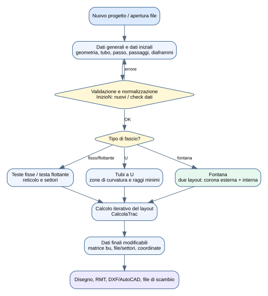
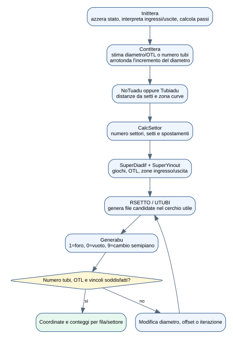
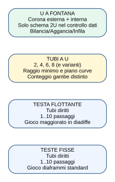
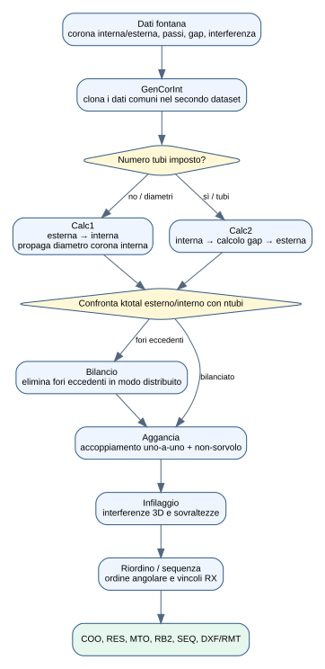
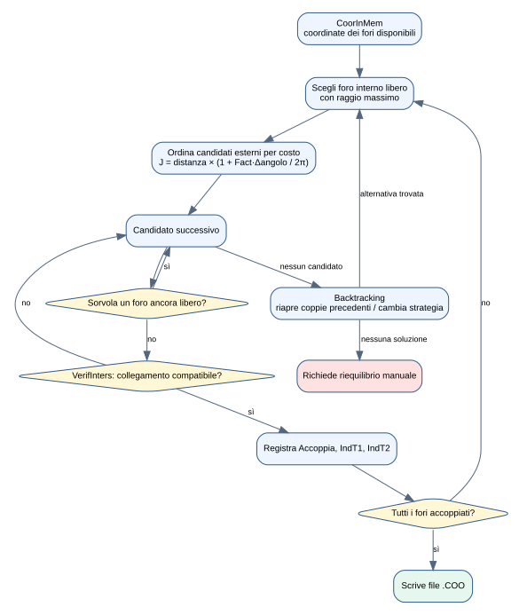
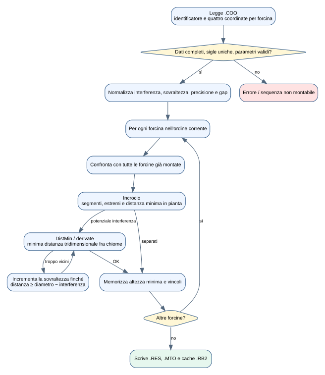

> **Scopo e limiti.** Questo documento descrive ciò che implementa il codice
> VB.NET presente in `src/Traccia`. Non sostituisce una verifica di progetto,
> una norma TEMA/ASME o la validazione dei risultati da parte di un ingegnere.
> I nomi delle grandezze sono mantenuti vicini al legacy per facilitare
> breakpoint, confronto e futura estrazione del core matematico.

## Indice

1. Scopo e architettura del modulo
2. Dati in ingresso, stato e risultati
3. Algoritmo comune di generazione del layout
4. Tipologie: teste fisse, testa flottante, U e fontana
5. Fontana: generazione e bilanciamento
6. Fontana: aggancio
7. Fontana: infilaggio
8. Sequenza e output
9. Percorso consigliato nel debugger
10. Mappa del codice e rischi della futura riscrittura

# 1. Che cosa fa il modulo

Traccia genera la disposizione dei fori sulle piastre tubiere di scambiatori
Shell & Tubes. A partire da diametri, tubo, passo, schema del reticolo, numero
di passaggi e vincoli geometrici, costruisce file e settori, determina quali
posizioni contengono un tubo, calcola OTL e conteggi e produce disegni e file
di scambio. Per i fasci a U a fontana aggiunge tre problemi distinti:

1. equilibrare il numero di fori tra corona interna ed esterna;
2. accoppiare ogni foro interno con un foro esterno senza bloccare il montaggio;
3. simulare l'infilaggio tridimensionale e ricavare sovraltezze e sequenza.

Le strutture principali sono contenute in `clsTracciatura.typDaTos`. La matrice
`bu(fila,posizione)` codifica il layout: `1` indica un foro/tubo presente, `0`
una posizione vuota e `9` una discontinuità usata per passare al semipiano
simmetrico. Gli array `x`, `y`, `NumeroTubiFila`, `FilaIniziale`,
`FilaFinale`, `NumeroTubiSettore`, `ici` e `hsym` descrivono la geometria
compatta che viene poi trasformata in coordinate.

# 2. Dati in ingresso, stato e risultati

## 2.1 Ingressi geometrici essenziali

| Gruppo | Variabili legacy indicative | Significato |
|---|---|---|
| Contorno | `di0`, `di1`, `OTL`, `otimp` | diametro imposto/calcolato e outer tube limit |
| Tubo | `dtubo`, `Spmm`, `Tublu` | diametro, spessore e lunghezza tubo |
| Reticolo | `TipoPasso`, `Passo`, `PassoVerticale`, `PassoOrizzontale` | orientamento e passo del reticolo |
| Circuitazione | `PassoFascio`, `NumeroSettori` | numero/configurazione dei passaggi e settori |
| U-bend | `radiu`, `CurveInPianoVert`, `Passi4CurveVert` | raggio minimo e orientamento curve |
| Diaframmi | `pdiaf`, `p1`, `tagli`, `tcava` | passo, taglio e cava del setto |
| Fontana | `cori`, `coriint`, `coriext`, `passoint`, `Interf`, `GapCurve`, `Varco` | separazione delle corone e vincoli di montaggio |

La routine di controllo verifica intervalli ed enumerazioni, coerenza del
numero di passaggi, presenza di tubo/passo/diametri e vincoli specifici. Per
la fontana il controllo ammette il percorso `_2U`; per gli U tradizionali
sono trattate le configurazioni pari previste dal codice.

## 2.2 Risultati

- coordinate dei centri dei fori e appartenenza a fila/settore;
- numero totale di tubi/fori e numero per fila e settore;
- OTL, diametro limite, area e perimetro della tracciatura;
- geometria di setti, tagli, tiranti, sealing strips e zone libere;
- per la fontana: coppie interno/esterno, sovraltezze, raggi, ordine di montaggio;
- disegno su schermo, DXF/AutoCAD, RMT e file intermedi/finali.

# 3. Algoritmo comune di generazione del layout

La routine centrale è `CalcolaTrac`. Non colloca semplicemente punti in un
cerchio: esegue un ciclo iterativo perché numero tubi, OTL, diametro e
disposizione delle file si influenzano reciprocamente.

Passo per passo:

1. **`InitItera`** azzera lo stato transitorio, interpreta le opzioni di zona
   ingresso/uscita, stabilisce margini delle cave e calcola le componenti del
   passo con `RPASSO`.
2. **`ContItera`** stima un diametro iniziale dall'area del reticolo quando il
   diametro non è imposto; se manca il numero di tubi ne ricava una stima
   dall'area utile. Il diametro viene arrotondato a incrementi dipendenti dalla
   dimensione.
3. **`NoTuadu` / `Tubiadu`** definiscono le distanze dai setti; nel caso U
   trattano la zona di curvatura e il raggio.
4. **`CalcSettor`** traduce il codice dei passaggi in settori e setti e assegna
   gli scostamenti orizzontali. Il comportamento cambia per codici pari,
   dispari e per curve nel piano verticale.
5. **`SuperDiadif`** calcola il gioco fra fascio e diaframmi; **`SuperYinout`**
   uniforma o calcola le zone di ingresso/uscita.
6. **`RSETTO` / `UTUBI`** generano le file candidate all'interno del contorno,
   applicando simmetrie, setti e limiti della curva U.
7. **`Generabu`** materializza la matrice di presenza. Rimuove le posizioni che
   cadono nella corona esclusa, aggiorna conteggi e calcola l'OTL massimo.
8. Il ciclo confronta tubi ottenuti, OTL e diametri richiesti; modifica offset
   o diametro e ripete fino a soluzione o al limite di iterazioni.

# 4. Tipologie di fascio

## 4.1 Teste fisse (`TesteFisse = 1`)

Il tubo è diritto e collega due piastre solidali all'apparecchio. Il layout è
generato una sola volta. Il numero di passaggi determina settori e setti; il
reticolo può essere triangolare o quadrato, normale o ruotato. Il gioco
diaframmi è calcolato da `diadiffe` con la serie destinata ai fasci non
flottanti. Non esistono accoppiamento fra due corone né simulazione delle
chiome U.

Controlli principali: tubo dentro OTL, distanza da contorno/cave, simmetria,
zone d'ingresso e uscita, coerenza del numero di tubi e dei passaggi, tagli dei
diaframmi e posizioni escluse.

## 4.2 Testa flottante (`TestaFlottante = 2`)

Il generatore geometrico è quello dei tubi diritti, ma `diadiffe` usa giochi
maggiorati e soglie dipendenti dal diametro (`di1`). Questo influenza l'OTL
disponibile prima della generazione delle file. Il resto della pipeline —
settori, matrice `bu`, coordinate, disegno e output — resta comune.

## 4.3 Tubi a U (`Utube = 3`)

Ogni tubo ha due gambe collegate da una curva. Il programma distingue il
numero di fori/gambe dal numero di tubi e riserva una zona alla curvatura.
`Tubiadu` usa il raggio richiesto (`radiu`) o lo riconcilia con la distanza
geometrica disponibile; le opzioni `CurveInPianoVert` e `Passi4CurveVert`
modificano simmetrie, settori e conteggi. Il codice gestisce configurazioni a
2, 4, 6, 8 e ulteriori codici pari presenti nell'enumerazione legacy.

Controlli specifici: raggio minimo, spazio per la curva, distanza sui setti,
duplicazione corretta delle gambe, posizione della fila centrale e coerenza
fra configurazione U e numero di passaggi.

## 4.4 Tubi a U a fontana (`Fontana = 4`)

La fontana è modellata con **due istanze di `typDaTos`**: dataset `0` per la
corona esterna e dataset `1` per quella interna. Non è quindi un semplice
caso grafico del fascio U: richiede due tracciature compatibili e un problema
di accoppiamento/montaggio.

# 5. Fontana: generazione e bilanciamento

## 5.1 Generazione delle due zone

`GenCorInt` copia nel dataset interno i dati comuni, re-inizializza gli array e
imposta passo e diametro della corona interna. `Fontana` salva la condizione
iniziale e tratta temporaneamente entrambe le zone come layout a teste fisse a
un passaggio, così da riutilizzare `CalcolaTrac` senza duplicarne la matematica.

- Se il numero tubi non è imposto, **`Calc1`** calcola prima la corona esterna,
  poi l'interna e propaga il diametro ottenuto.
- Se il numero tubi è imposto, **`Calc2`** calcola prima l'interna, ricava il
  gap tra zone e calcola infine l'esterna.

Al termine ripristina il tipo Fontana e `_2U`. Questa mutazione temporanea è
importante per il debug: un breakpoint dentro `CalcolaTrac` vedrà
`TipoFascio=TesteFisse`, anche se l'operazione complessiva è una fontana.

## 5.2 Bilanciamento

Le due zone possono produrre numeri diversi di fori e, di norma, non meno del
numero richiesto. `inizio2` decide lo stato successivo:

- conteggi uguali: passa all'aggancio;
- una zona ha meno fori del richiesto: soluzione impossibile;
- esistono fori eccedenti: richiede bilanciamento.

`Bilancio` ordina le posizioni e marca come vuote (`bu = 0`) quelle eccedenti,
aggiornando conteggi per fila, settore e totale. Il criterio mira a mantenere
uniformità angolare e corrispondenza tra le due zone; la documentazione legacy
avverte che il bilanciamento automatico non garantisce l'esistenza di un
aggancio e può richiedere correzioni manuali.

# 6. Fontana: algoritmo di aggancio

L'aggancio costruisce una corrispondenza biunivoca tra fori interni ed esterni.
Le strutture chiave sono `Accoppia(tubo,zona)`, `IndT1(coppia)` e
`IndT2(coppia)`.

Per la coppia successiva:

1. sceglie il foro **interno** libero più lontano dal centro;
2. valuta ogni foro **esterno** libero;
3. calcola distanza e differenza angolare rispetto alla direzione radiale;
4. ordina col costo implementato

`J = d × (1 + Fact × Δθ / (2π))`

dove `Fact` è il fattore di strategia letto dall'INI;
5. `Sorvolo` rifiuta il collegamento se il segmento passa troppo vicino a un
   foro ancora libero: la soglia usa il diametro e l'interferenza ammessa;
6. `VerifInters` controlla la compatibilità con la geometria già costruita;
7. se nessun candidato funziona, l'algoritmo torna indietro, libera coppie
   precedenti e prova alternative. Può anche ridurre progressivamente `Fact`;
8. se il backtracking non trova soluzione, evidenzia il foro critico e chiede
   un nuovo bilanciamento; altrimenti scrive le coppie nel file `.COO`.

Il controllo di non-sorvolo non dimostra da solo la montabilità tridimensionale:
serve a evitare che una forcina impegni la proiezione di un foro che dovrà
essere utilizzato più tardi.

# 7. Fontana: algoritmo di infilaggio

L'infilaggio simula l'introduzione successiva delle forcine. Il codice è nel
modulo `Infila`; riceve diametro, sovraltezza, interferenza ammessa, altezza
minima, precisione e gap delle curve.

## 7.1 Preparazione

Il programma legge `.COO`, controlla che ogni identificativo sia unico e che
ogni record abbia le quattro coordinate degli estremi. Normalizza i parametri:

- `Interf` non può superare metà diametro;
- sovraltezza assente → circa `diametro/10`;
- precisione limitata tra `diametro/100` e `diametro/10`, con default
  `diametro/20`;
- il gap di curva interno usa `GapCurve + diametro`.

## 7.2 Controllo geometrico

Per ogni forcina, confrontata con quelle già montate:

- **`Incrocio`** verifica in pianta intersezioni tra segmenti e distanze degli
  estremi dalle altre linee usando la soglia `diametro − interferenza`;
- quando la proiezione può interferire, le routine `Dist`, `DerDist`,
  `DerDerDist` e **`DistMin`** cercano la distanza minima tridimensionale fra
  le chiome parametrizzate. La ricerca combina avanzamento limitato e
  interpolazione sulla derivata;
- se la distanza non è sufficiente, aumenta l'altezza/sovraltezza e ripete;
- memorizza per ciascuna forcina l'altezza minima compatibile e il riferimento
  all'elemento limitante.

L'output `.MTO` è poi usato anche dalla distinta: contiene gruppi, raggio e
lunghezza rettilinea. `.RES` e `.RB2` conservano risultati e stato intermedio.

# 8. Sequenza, raggi X e output

`Riordino` ordina le coppie a partire dall'angolo `Anomal0` e, a parità
angolare, dalla distanza dal centro. `SorvoloRX` confronta i collegamenti già
marcati con pausa radiografica: rifiuta intersezioni interne e distanze minori
di `diametro − Interf`. Il parametro `Varco` definisce un settore senza pause.

Gli output osservati nel codice comprendono:

| Estensione/oggetto | Contenuto o uso |
|---|---|
| `.TRK` | progetto/tracciatura serializzata legacy |
| `.COO` | coppie e coordinate per la fontana |
| `.RES` | risultato dell'infilaggio |
| `.MTO` | gruppi di forcine per distinta materiali |
| `.RB2` | cache serializzata dello stato d'infilaggio |
| `.SEQ` | specifica di sequenza di montaggio |
| DXF/DGE | geometria per AutoCAD |
| RTF/Word | relazioni, tabelle e richiesta materiali |

# 9. Percorso consigliato nel debugger

## Layout ordinario

1. breakpoint in `InizioN.inizio1`;
2. entrare in `CalcolaTrac`;
3. osservare `InitItera`, `ContItera`, `CalcSettor`;
4. fermarsi in `Generabu` e ispezionare `bu`, `x`, `y`, `ici`;
5. confrontare `ktotal`, `ntubi`, `OTL`, `di1` a ogni iterazione.

## Fontana

1. breakpoint in `InizioN.Fontana` e `GenCorInt`;
2. seguire `Calc1` o `Calc2` e alternanza di `QualeCorona`;
3. osservare `inizio2` per la decisione bilanciamento/aggancio;
4. in `Bilancio`, controllare quali celle passano da `1` a `0`;
5. in `Aggancia`, monitorare `iCoppia`, `iTubo1`, `NewDist`, `iTubo2`,
   `Accoppia`, `Fact` e i ritorni di `Sorvolo`;
6. in `Infila.Infilaggio`, fermarsi su `Incrocio` e `DistMin`, osservando
   altezza, distanza minima e forcina limitante;
7. verificare `.COO`, `.RES`, `.MTO` e `.SEQ` prodotti nella commessa.

# 10. Mappa del codice

| File | Responsabilità principale |
|---|---|
| `Tracciatura.vb` | API del modulo, struttura dati, lettura/scrittura, disegno e documenti |
| `InizioN.vb` | generatore geometrico, iterazione, fontana, bilancio, aggancio e sequenza |
| `Infila.vb` | simulazione di montaggio e distanza tridimensionale tra forcine |
| `frmTracciat.vb` | interazione utente, disegno e modifica dei dati finali |
| `Tr13N.vb` | inizializzazione, caricamento e collegamento con Lancio/PPSM |
| `OpFin.vb`, `frmDatiOut.vb` | opzioni e presentazione degli output |

# 11. Rischi tecnici da preservare nella futura riscrittura

- distinguere sempre **numero tubi**, **numero fori** e **numero gambe**;
- preservare convenzioni `bu=0/1/9`, indici base 1 e simmetrie `hsym`;
- rendere esplicita la mutazione temporanea Fontana → TesteFisse;
- isolare la funzione obiettivo dell'aggancio e renderne configurabile `Fact`;
- trasformare backtracking, criteri di arresto e messaggi in risultati tipizzati;
- sostituire gradualmente file binari/cache senza perdere la lettura storica;
- costruire golden tests su layout reali prima di estrarre il core in F#.

# Appendice A — Fonti analizzate

La descrizione è ricavata dai sorgenti correnti `src/Traccia/*.vb` e dalla
documentazione originale conservata in `legacy/traccia.NET/Aiuto`, in
particolare `Panoramica.htm`, `Procedura.htm`, `Prototipi.htm`, `fontGen.htm`,
`fontBil.htm` e `fontAgg.htm`. Dove la documentazione legacy è incompleta,
il comportamento è descritto direttamente dalle routine eseguibili.
