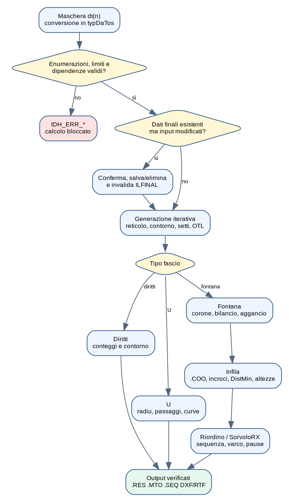

# Scopo e perimetro dei controlli

Questo documento elenca i controlli effettivamente osservati nel percorso
**input → generazione → bilanciamento → aggancio → infilaggio → output**. Per
“controllo di processo” si intende sia una validazione bloccante, sia un
avviso, una correzione automatica o un controllo di coerenza intermedio. Non è
una certificazione normativa e non sostituisce la verifica ingegneristica.



# 1. Classificazione degli esiti

| Classe | Comportamento | Esempio |
|---|---|---|
| Errore bloccante | annulla o impedisce il calcolo | passo `<= dtubo`, dati essenziali mancanti |
| Avviso con scelta | chiede se proseguire o correggere | raggio U inferiore al minimo assunto TEMA |
| Correzione automatica | normalizza il dato e continua | limiti di `Preciso`, `Interf`, valori negativi di `yin/yout` |
| Rigenerazione | invalida risultati e ricalcola | variazione di dati dopo produzione dei dati finali |
| Ricerca alternativa | cambia candidato o torna indietro | intrappolamento nell'aggancio fontana |
| Controllo diagnostico | segnala ma non rappresenta una prova normativa | file incompleto, identificativo ripetuto, cache non coerente |

# 2. Acquisizione e coerenza della maschera

La funzione `Dati` trasferisce gli slot `dt(n)` nei membri nominati di
`typDaTos`, quindi controlla enumerazioni, limiti e dipendenze. Il primo errore
imposta `kdati` con uno degli identificativi `IDH_ERR_*`; `MostraAiuto`
presenta il messaggio associato.

## 2.1 Enumerazioni ammesse

```text
matub       deve appartenere a 0..2
TipoPasso   deve appartenere a 1..4
PassoFascio deve appartenere a 1..20
TipoFascio  deve appartenere a 1..4
```

Valori esterni producono rispettivamente `IDH_ERR_MATTUBI`,
`IDH_ERR_TIPOPASSO`, `IDH_ERR_NUMPASSI`, `IDH_ERR_TIPOFASCIO`.

## 2.2 Limiti dimensionali e dati indispensabili

| Condizione controllata | Esito |
|---|---|
| `di0 > 10000` | diametro mantello troppo grande |
| `dtin > 5000` oppure `dtout > 5000` | diametro bocchello fuori limite |
| bocchello maggiore di `di0` quando il mantello è definito | incoerenza bocchello–mantello |
| `ntubi=0` e `di0=0` | manca sia il numero tubi sia il diametro di calcolo |
| `dtubo < 1` | diametro tubo non valido |
| `Passo <= dtubo` | reticolo fisicamente incoerente |

## 2.3 Dipendenze dei dati di processo

```text
SE roin != 0:
    win deve essere diverso da 0
    dtin deve essere diverso da 0

SE roout != 0:
    wout deve essere diverso da 0
    dtout deve essere diverso da 0
```

Questi controlli verificano la completezza delle grandezze usate per stimare
le zone libere di ingresso/uscita. Le routine calcolano area del bocchello,
velocità e un termine `ρv²`, limitato dal codice a `3000`, poi ricavano `yin`
e `yout`; risultati negativi vengono portati a zero.

# 3. Invalidazione dei risultati esistenti

Prima di accettare dati modificati, il software confronta numerose grandezze
con i valori vettore precedenti: diametri, numero tubi, tipo di passo/fascio,
materiale, raggio U, passo diaframmi, cave, distanze sui setti, criterio OTL e
parametri della fontana. Se `ILFINAL=1`, avverte che i dati finali esistenti
non sono più coerenti e propone salvataggio/eliminazione prima di ricalcolare.

Questo è un controllo di tracciabilità importante: impedisce di utilizzare
automaticamente una distinta o sequenza prodotta con input differenti.

# 4. Controlli specifici dei tubi diritti

- verifica di contorno: i centri devono ricadere nell'area utile dopo giochi,
  cave, setti e mezzo diametro tubo;
- verifica di reticolo: `TipoPasso` determina componenti orizzontale e
  verticale coerenti;
- verifica dei settori: il codice di circuitazione deve produrre settori e
  file compatibili;
- verifica iterativa di `ntubi`, `OTL`, `di0/di1`: il generatore modifica
  diametro/offset finché raggiunge il vincolo o termina la ricerca;
- esclusione delle celle `bu=0` e trattamento delle discontinuità `bu=9`;
- aggiornamento di `NumeroTubiFila`, `NumeroTubiSettore`, `ktotal` e OTL.

# 5. Controlli specifici dei tubi a U

`CheckDati`, quando è attiva la pagina relativa, confronta:

`radiu < 1,5 × dtubo`.

Se la condizione è vera, avverte che il raggio è inferiore al minimo indicato
nel messaggio come TEMA. L'utente può proseguire; se rifiuta, il programma
porta automaticamente `radiu` a `1,5×dtubo`.

Il tipo U accetta nel controllo principale soltanto i codici di passaggio
previsti dal legacy (`2`, `6`, `8`, `10`). Altri codici producono
`IDH_ERR_PASSOnoU`. La generazione verifica inoltre spazio della curva,
distanze sui setti, duplicazione delle gambe e opzioni del piano verticale.

# 6. Controlli specifici della fontana

## 6.1 Coerenza iniziale

| Condizione | Esito |
|---|---|
| `ntubi=0` e `coriext=0` | mancano numero tubi e diametro esterno corona interna |
| `PassoFascio != _2U` | configurazione di passaggi non ammessa per fontana |
| `dt(34) <= dt(44)` | corona esterna/interna geometricamente incoerenti |

## 6.2 Bilanciamento

Confronta i numeri effettivi delle due corone. Se una corona non raggiunge il
numero richiesto, la soluzione è impossibile; se esistono eccedenze,
`Bilancio` elimina celle `bu` aggiornando tutti i contatori. Il bilanciamento
non dimostra che esista un accoppiamento montabile.

## 6.3 Aggancio e intrappolamento

Per ogni candidato vengono eseguiti:

1. unicità implicita mediante `Accoppia=0`;
2. priorità distanza–radialità `J`;
3. `Sorvolo`: nessun foro libero nella fascia `dtubo-Interf` del segmento;
4. `VerifInters`: il segmento non deve attraversare la zona centrale;
5. backtracking se nessun candidato è valido;
6. riduzione di `Fact` e rigenerazione se il tentativo globale resta incompleto.

Il fallimento produce `IDH_ERR_TRAPPOLA` o lo stato “Non è stato possibile
trovare una soluzione”; non deve essere confuso con un errore di input.

# 7. Controlli dell'infilaggio tridimensionale

Prima del calcolo `Infila` controlla:

- esistenza e leggibilità di `.COO`;
- una sigla unica per ogni tubo;
- quattro coordinate presenti per ogni riga;
- almeno un tubo valido;
- `Diametro>0`, `SovrAlt>=0`, `Interf>=0`, `AltMin>=0`, `Preciso>=0`.

Normalizzazioni applicate:

```text
Interf  = min(Interf, Diametro/2)
SovrAlt = Diametro/10             se non positivo
Preciso = clamp(Preciso,
                Diametro/100,
                Diametro/10)      se fornito
Preciso = Diametro/20             se assente
GapCurveEffettivo = GapCurve + Diametro
```

Per ogni nuova forcina `Incrocio` verifica estremi, proiezioni e intersezioni
planari rispetto alle forcine montate. Nei casi potenzialmente interferenti,
`DistMin` ricerca la distanza minima tridimensionale; la sovraltezza viene
aumentata finché la distanza è compatibile. Se una forcina non può essere
montata sulla precedente, viene emesso un errore specifico.

# 8. Controlli sulla sequenza e accessibilità

`Riordino` usa angolo e raggio per proporre l'ordine; `SorvoloRX` verifica
intersezioni e distanze rispetto alle coppie marcate, rispettando `Varco`.
Questi controlli sono legati alla sequenza e alle pause RX, non sostituiscono
la simulazione tridimensionale né garantiscono automaticamente l'accesso a
tutti i giunti tubo-piastra.

# 9. Controlli sui file e sugli output

| File/stato | Controllo |
|---|---|
| `.COO` | può essere riutilizzato previa conferma; sigle e campi vengono ricontrollati da Infila |
| `.RES`, `.MTO`, `.RB2` | se tutti presenti, il programma propone il riuso del calcolo precedente |
| `.SEQ` | se esiste, propone l'uso della sequenza già definita |
| `.ADU` / RMT | `ControllaRMT` confronta i dati disponibili per la distinta |
| serializzazione legacy | richiede esplicita abilitazione e file attendibili |

# 10. Limiti dei controlli attuali

- molte verifiche restituiscono soltanto un messaggio e non un risultato
  tipizzato con campo, valore, limite e severità;
- alcuni limiti sono numeri incorporati nel codice e non riportano edizione o
  paragrafo normativo;
- `Sorvolo` e `VerifInters` sono controlli planari parziali;
- il greedy può fallire anche quando esiste una configurazione globale;
- cache e file intermedi possono derivare da una versione precedente;
- l'uso di `DoEvents` e aggiornamenti grafici rende meno deterministico il
  tempo di esecuzione, non il risultato matematico atteso.

# 11. Controlli raccomandati nella nuova architettura

Ogni controllo dovrebbe produrre un record:

```text
ValidationResult(
    Code,
    Severity,
    Field,
    Symbol,
    ActualValue,
    ExpectedRange,
    RuleSource,
    SuggestedCorrection)
```

Si raccomandano inoltre: unità dimensionali tipizzate, tolleranze esplicite,
versione della regola, hash degli input nei file risultato, golden test su
commesse storiche e verifica separata di fattibilità, ottimalità e
accessibilità al controllo del giunto.

