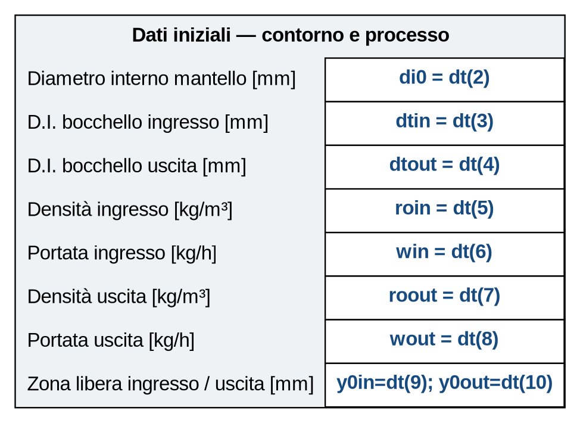
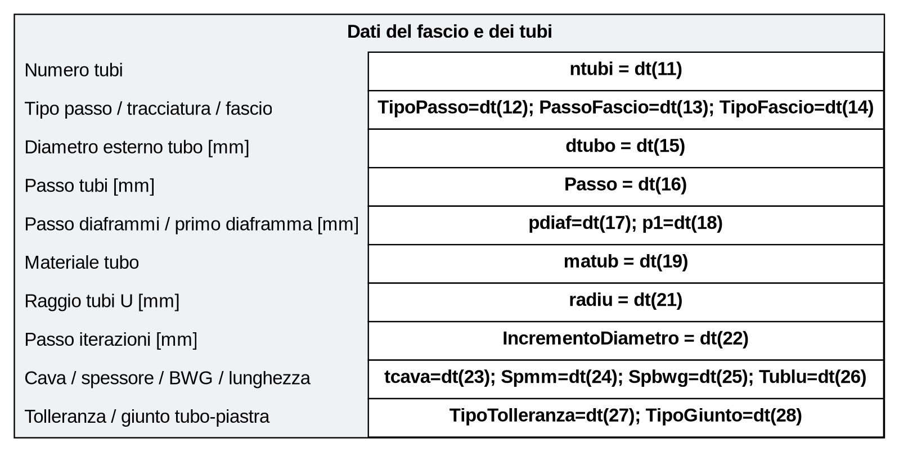
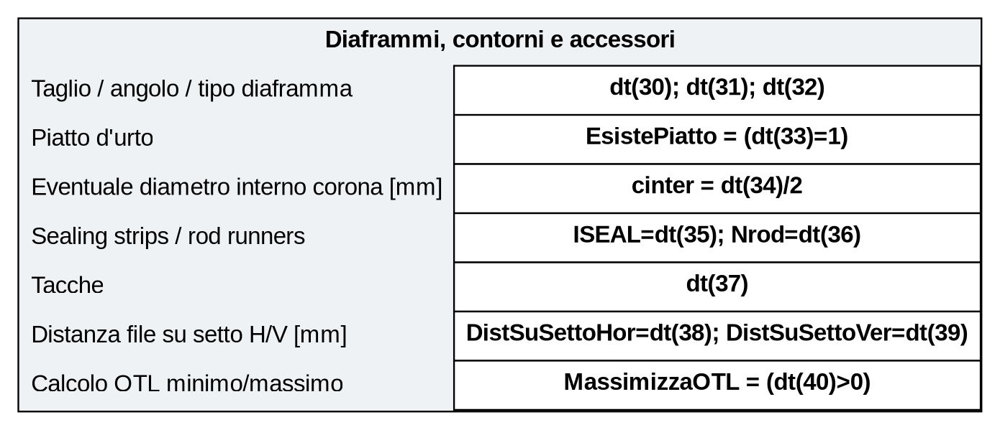
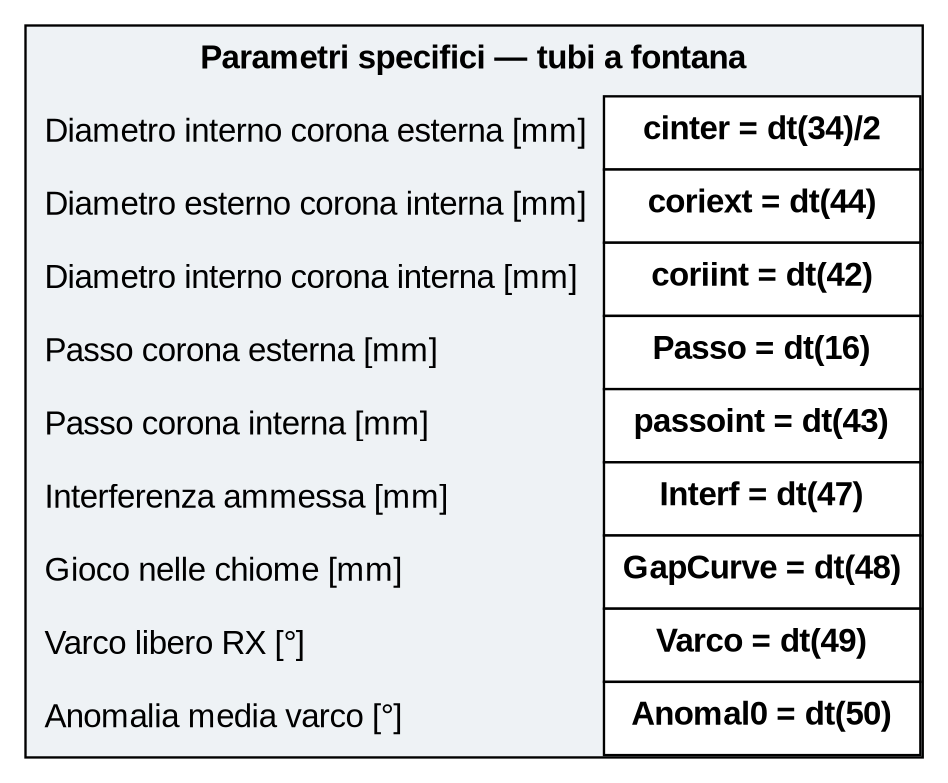

# Mappa fra maschere di input e simboli

Le figure seguenti riproducono schematicamente i gruppi della maschera **Dati
di progetto**. Dentro ogni casella bianca non è mostrato un valore di esempio,
ma il simbolo che riceve quel dato nelle routine. La corrispondenza è ricavata
dagli array `igr1`, `igr2`, `igr3`, `igr41`/`igr42`, dalle etichette
`nominput(n)=at1(106+n)` e dal trasferimento `dt(n) → typDaTos` in `Dati`.

## Campi comuni — pagina iniziale

| Campo mostrato | Slot maschera | Simbolo effettivo |
|---|---:|---|
| Diametro interno mantello | `dt(2)` | `di0` |
| D.I. bocchello ingresso/uscita | `dt(3)`, `dt(4)` | `dtin`, `dtout` |
| Densità ingresso/uscita | `dt(5)`, `dt(7)` | `roin`, `roout` |
| Portata ingresso/uscita | `dt(6)`, `dt(8)` | `win`, `wout` |
| Zona libera ingresso/uscita | `dt(9)`, `dt(10)` | `y0in`, `y0out` |

## Tubi diritti e dati generali

`TipoPasso`, `PassoFascio`, `TipoFascio`, `matub`, `TipoTolleranza` e
`TipoGiunto` sono selezioni codificate; gli altri campi sono numerici. Il
simbolo `IncrementoDiametro` è globale alla routine iterativa e non fa parte
della struttura `typDaTos`.

## Tubi a U

Nella stessa maschera il campo **Raggio tubi a U (0=STD)** alimenta
`radiu = dt(21)`. Le opzioni **Fila centrale storta** e **Curve su piano
verticale** alimentano rispettivamente `FilaCentraleStorta` e
`Passi4CurveVert`/`CurveInPianoVert` secondo la pagina e la configurazione.

## Diaframmi e dati finali

La voce **Eventuale diametro interno corona** viene trasformata in
`cinter=dt(34)/2`: la maschera chiede un diametro, mentre le verifiche
geometriche lavorano con il raggio.

## Fontana

| Campo mostrato | Slot maschera | Simbolo effettivo |
|---|---:|---|
| Diametro interno corona esterna | `dt(34)` | `cinter=dt(34)/2` |
| Diametro esterno corona interna | `dt(44)` | `coriext` |
| Diametro interno corona interna | `dt(42)` | `coriint` |
| Passo corona esterna | `dt(16)` | `Passo` |
| Passo corona interna | `dt(43)` | `passoint` |
| Interferenza ammessa | `dt(47)` | `Interf` |
| Gioco nelle chiome | `dt(48)` | `GapCurve` |
| Varco libero RX | `dt(49)` | `Varco` |
| Anomalia media del varco | `dt(50)` | `Anomal0` |

