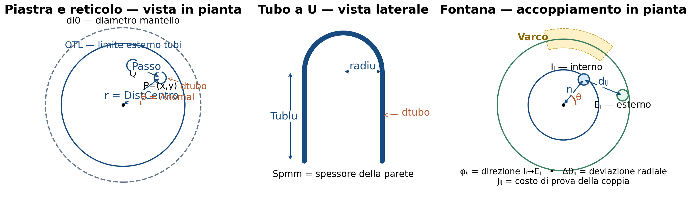

# Nomenclatura e simboli del software

Questa sezione raccoglie i simboli richiamati nel documento mantenendo, fra
parentesi o in codice, lo stesso identificatore usato da **Traccia** e dalle
classi collegate di **RoutBase1** e **Infila**. Le grandezze geometriche sono
espresse normalmente in millimetri e gradi nell'interfaccia; le routine
trigonometriche interne lavorano in radianti.

Nella vista della piastra `di0` è il diametro disponibile del mantello, `OTL`
è il diametro limite dei tubi, `dtubo` è il diametro del singolo foro/tubo e
`Passo` è la distanza centro-centro. Il punto `P=(x,y)` è individuato anche da
`r=DistCentro` e `θ=Anomal`. Nella U, `radiu` descrive la curva fisica; nella
fontana `Iᵢ` ed `Eⱼ` sono gli estremi della coppia e `dᵢⱼ` la loro distanza in
pianta. Sono quindi grandezze diverse anche quando il legacy usa localmente il
nome generico `Raggio`.

## Coordinate, diametri e contorni

| Simbolo software | Significato operativo | Precisazione |
|---|---|---|
| `x`, `y` | coordinate cartesiane del centro di un foro | Origine nel centro della piastra; non indicano la posizione nella matrice `bu`. |
| `PuntiD(i,z)` | punto geometrico del foro `i` nella zona `z` | Oggetto `clsVec2` di RoutBase1; `z=0` esterna, `z=1` interna per la fontana. |
| `r`, `Raggio`, `DistCentro(i,z)` | distanza radiale `sqrt(x²+y²)` | Usata per scegliere, bilanciare e ordinare; non è il raggio di curvatura del tubo. |
| `θ`, `Anomal(i,z)` | angolo polare del foro | Calcolato da `arco(x/r,y/r)` e normalizzato nel riordino. |
| `di0` | diametro imposto o di ingresso del fascio | Il suo ruolo preciso dipende dalla modalità di calcolo bloccata su tubi o diametro. |
| `di1` | diametro utile/calcolato durante l'iterazione | Viene riconciliato con OTL, giochi e numero tubi. |
| `OTL` | *Outer Tube Limit* | Diametro del minimo contorno circolare che comprende i tubi, includendo mezzo diametro tubo. |
| `otimp` | OTL imposto | Vincolo dell'utente distinto dall'OTL calcolato. |
| `otlmax` | massimo OTL ammesso/individuato | Limite usato nelle iterazioni geometriche. |
| `dtubo`, `Diametro` | diametro esterno del tubo | `Diametro` è il nome usato anche nello stato `Franco` di Infila. |
| `Spmm`, `Spbwg` | spessore tubo in mm e designazione BWG | Rappresentazioni alternative dello stesso dato tecnologico. |
| `Tublu` | lunghezza del tubo | Lunghezza rettilinea di progetto, distinta dalla lunghezza della proiezione U. |
| `cinter` | raggio/limite della zona centrale libera | `VerifInters` impedisce al segmento di attraversare questa zona quando significativa. |
| `cori`, `coriint`, `coriext` | diametri di separazione, interno ed esterno delle corone | Usati esclusivamente nella geometria a fontana. |

## Reticolo, file, settori e circuitazione

| Simbolo software | Significato operativo | Precisazione |
|---|---|---|
| `Passo` | passo nominale del reticolo | Distanza caratteristica fra centri tubo. |
| `PassoOrizzontale`, `PassoVerticale` | componenti cartesiane del passo | Derivano da tipo/orientamento del reticolo. |
| `passoint` | passo della corona interna | Può differire dal passo della corona esterna nella fontana. |
| `TipoPasso` | codice dello schema del reticolo | Seleziona reticolo triangolare/quadrato e relativo orientamento. |
| `PassoFascio` | codice della circuitazione | Determina numero di passaggi, settori e setti. |
| `NumeroSettori` | numero dei settori geometrici | Non coincide necessariamente con il numero delle file. |
| `k`, `Settore(i,z)` | indice/settore di appartenenza | `k` è anche variabile di ciclo legacy; va interpretata dal contesto. |
| `j`, `Fila(i,z)` | indice/fila di appartenenza | Nella parte di matching `j` è anche usato convenzionalmente per il foro esterno. |
| `nnn`, `Posizbu(i,z)` | posizione nella fila e nella matrice `bu` | È distinta dall'identificativo enumerato del foro. |
| `bu(fila,posizione)` | matrice compatta del layout | `"1"` foro presente, `"0"` vuoto, `"9"` cambio/discontinuità di simmetria. |
| `ici(fila)` | numero di posizioni da esaminare nella fila | Limite del ciclo che ricostruisce le coordinate. |
| `hsym`, `icontr` | codici di simmetria e conteggio file del settore | Conservano la rappresentazione compatta legacy. |
| `FilaIniziale`, `FilaFinale` | estremi delle file appartenenti a un settore | Definiscono l'intervallo percorso da `CoorInMem`. |
| `NumeroTubiFila`, `NumeroTubiSettore` | contatori locali dei fori/tubi | Aggiornati anche dal bilanciamento. |
| `ntubi` | numero richiesto di tubi/fori secondo il contesto | Nei fasci U distinguere sempre tubo fisico, gambe e fori. |
| `ktotal` | totale effettivo delle posizioni presenti | È il totale enumerato dopo generazione/bilanciamento. |
| `Ntot` | contatore totale transitorio del generatore | Usato mentre si formano settori e file. |
| `pdiaf`, `p1`, `tagli`, `tcava` | passo diaframmi, parametri dei setti/tagli e cava | Condizionano zone escluse e geometria dei diaframmi. |
| `yin`, `yout`, `dtin`, `dtout` | limiti/dimensioni delle zone di ingresso e uscita | Usati per riservare le finestre di passaggio del fluido. |

## Tubi a U e fontana

| Simbolo software | Significato operativo | Precisazione |
|---|---|---|
| `radiu` | raggio minimo/richiesto della curva U | Non confondere con `DistCentro`. |
| `CurveInPianoVert` | orientamento delle curve U nel piano verticale | Modifica simmetrie, settori e conteggi. |
| `Passi4CurveVert` | opzione legacy per curve verticali e quattro passaggi | Attiva una gestione specifica della circuitazione. |
| `GapCurve` | gioco richiesto fra le curve della fontana | In Infila viene sommato al diametro per il controllo tridimensionale. |
| `Interf` (`ε`) | interferenza ammessa al montaggio | La distanza planare minima usata da `Sorvolo` è `dtubo-Interf`. |
| `Varco` | settore senza pause/ostacoli RX | Espresso in gradi; influenza il riordino finale. |
| `Anomal0` (`θ₀`) | angolo medio/iniziale del varco | Origine angolare corretta della sequenza finale. |
| `SovrAlt` | sovraltezza incrementale | Passo/valore iniziale usato nella simulazione di infilaggio. |
| `AltMin` (`MINALTO`) | tratto diritto minimo in altezza | Vincolo geometrico di Infila. |
| `Preciso` (`PRECISO`) | precisione della ricerca della distanza minima | Limitata dal codice fra `Diametro/100` e `Diametro/10`. |
| `Hmax`, `HCalc`, `Alt`, `Alt1` | altezze correnti e massime di montaggio | Stato iterativo del confronto fra due forcine. |
| `Raggio`, `Raggio1` in `Franco` | raggi delle due forcine confrontate | Contesto Infila, non raggio polare del foro. |
| `Utub`, `Utub1` | proiezioni planari delle due forcine | Oggetti `clsLinea2` di RoutBase1. |
| `CC`, `CC1` | coseni/direzioni unitarie delle proiezioni | Oggetti `clsVec2`, usati in proiezioni e distanze. |
| `Lun`, `Lun1` | lunghezze delle proiezioni planari | Limiti dei parametri lungo i segmenti. |

## Accoppiamento della fontana

| Simbolo software | Significato operativo | Precisazione |
|---|---|---|
| `I={Iᵢ}` | insieme dei fori della corona interna | Nel VB: `PuntiD(i,1)`. |
| `E={Eⱼ}` | insieme dei fori della corona esterna | Nel VB: `PuntiD(j,0)`. |
| `i`, `iTubo1` | identificativo del foro interno corrente | È un indice di enumerazione, non un ordine radiale. |
| `j`, `iTubo2` | identificativo del candidato esterno | Nel codice `iTubo` è usato anche come indice generico di scansione. |
| `dᵢⱼ`, `Distl` | distanza euclidea fra `Iᵢ` ed `Eⱼ` | Lunghezza della corda in pianta. |
| `φᵢⱼ`, `Ang1` | angolo del vettore `Iᵢ→Eⱼ` | Confrontato con la direzione radiale dell'interno. |
| `Δθᵢⱼ`, `DAng` | minima differenza angolare | Riportata nell'intervallo `[0,π]`. |
| `Fact` (`F`) | peso della deviazione angolare | `Aggancia` parte da `2` e può diminuirlo di `0,25`. |
| `Jᵢⱼ`, `NewDist` | costo `dᵢⱼ[1+Fact·Δθᵢⱼ/(2π)]` | Stabilisce l'ordine di prova, non l'ottimo globale. |
| `NewInd` | traduzione posizione-candidato | Contiene l'identificativo reale dell'esterno associato a `NewDist`. |
| `Accoppia(i,z)` | stato del foro | `0` libero; altro valore = numero della coppia assegnata. |
| `IndT1(k)`, `IndT2(k)` | estremi interno ed esterno della coppia `k` | Sono i dati principali scritti nel file `.COO`. |
| `iCoppia` (`k`) | profondità/coppia corrente | Avanza dopo ogni registrazione valida. |
| `iProfond` (`p`) | profondità di ripresa del backtracking | Memorizza il livello dal quale ricostruire. |
| `Proiez` (`s`) | ascissa della proiezione del foro sulla retta | Il foro è fra gli estremi quando `0<s<d`. |
| `Dist1` (`h`) | distanza perpendicolare foro-retta | Fa scattare `Sorvolo` se `<dtubo-Interf`. |

## File e risultati

| Simbolo | Contenuto |
|---|---|
| `.TRK` | progetto/tracciatura legacy serializzata |
| `.COO` | coppie, coordinate, file e posizioni della fontana |
| `.PAS` | coordinate espresse nel reticolo/passi |
| `.DGE` | dati geometrici generali in formato ASCII |
| `.RES` | risultati della simulazione d'infilaggio |
| `.MTO` | raggruppamenti e dati per distinta materiali |
| `.RB2` / `.$B2` | stato/cache interno della simulazione |
| `.SEQ` | sequenza di montaggio |
| `.DXF` / DGE | esportazione geometrica verso CAD |

